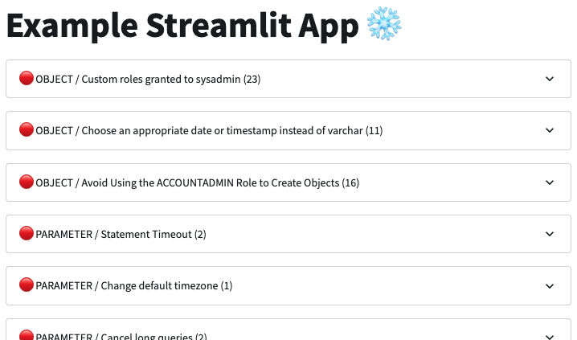

[](https://opensource.org/licenses/Apache-2.0)
[](https://getdbt.com/)
[](https://www.snowflake.com/)
[](https://www.streamlit.io/)

# Snowflake Account Evaluator

## Problem Statement

Creating a new Snowflake account is so easy, you need just some clicks and you are ready!
That is awesome how simple start with these SaaS products like Snowflake. The developers, engineers load the necessary data, process it and surface in some dashboards after some quite easy and fast steps...

And after a while some questions come up:
- I need to manage users, roles, wrehouses, stages, etc... Have no idea how to do it well.
- I having some performance issues!
- Is my account safe security wise?
- Why is our cost is getting higher and higher every month?

## Project Description

So, this package try to help you:
- to run a health check for a Snowflake account
- to evaluate whether the account adheres to various rules/best practices 
- to visualize results within a streamlit app

## Installation and Configuration

### Installing the package

1. Clone this repository to your local machine:

   ```bash
   git clone https://gitlab.infinitelambda.com/infinitelambda/bi-chapter/snowflake-evaluator/
   cd snowflake-evaluator
   ```

2. Create a virtual environment for the project. Replace `<venv_name>` with your preferred environment name (e.g., "myenv"):

   ```bash
   python3 -m venv <venv_name>
   ```

   Activate the virtual environment:

   ```bash
   source <venv_name>/bin/activate
   ```

3. Install the required Python dependencies:

   ```bash
   pip install -r requirements.txt
   ```

4. Snowflake settings

    You need a credential to connect to your Snowflake account with this tool.
    There are more ways to do this, we provide a simple user/pass option!

    You have other options connecting to your Snowflake account, using key-pair authentication for instance.
    Please check the [Snowflake documentation](https://docs.snowflake.com/en/guides-overview-connecting)!

    So, you need a database, a role, a warehouse and a user for this package. Here it is one example how to create these objects in your Snowflake account:
    ```SQL
    -- Create role
    CREATE ROLE ROLE_MAINTENANCE;
    GRANT ROLE ACCOUNTADMIN TO ROLE ROLE_MAINTENANCE;
    GRANT IMPORTED PRIVILEGES ON DATABASE SNOWFLAKE TO ROLE ROLE_MAINTENANCE;
    -- Create user
    CREATE USER IF NOT EXISTS USER_MAINTENANCE
        PASSWORD = 'xxxxxxxx'
        DEFAULT_ROLE = ROLE_MAINTENANCE
        DEFAULT_WAREHOUSE = WH_MAINTENANCE
        DEFAULT_NAMESPACE = MAINTENANCE;
    GRANT ROLE ROLE_MAINTENANCE TO USER USER_MAINTENANCE;
    -- Create DB
    CREATE DATABASE MAINTENANCE;
    GRANT USAGE ON DATABASE MAINTENANCE TO ROLE ROLE_MAINTENANCE;
    GRANT ALL ON DATABASE MAINTENANCE TO ROLE ROLE_MAINTENANCE;
    -- Create WH
    CREATE WAREHOUSE WH_MAINTENANCE
        WAREHOUSE_SIZE = XSMALL
        MAX_CLUSTER_COUNT =1
        MIN_CLUSTER_COUNT = 1
        AUTO_SUSPEND = 60
        AUTO_RESUME = TRUE
        INITIALLY_SUSPENDED = TRUE;
    GRANT ALL PRIVILEGES on WAREHOUSE WH_MAINTENANCE TO ROLE ROLE_MAINTENANCE;
    ```

5. Add your Snowflake account credentials to your dbt profile:

    For other authentication methods please check the related [dbt documentation guide](https://docs.getdbt.com/docs/core/connect-data-platform/snowflake-setup)!

    ```bash
    ~/.dbt/profile.yml
    ```
    Example settings:
    ```YAML
    snowflake_evaluator:
    target: my_account
    outputs:
        my_account:
        type: snowflake
        account: <<MY_ACCOUNT_LOCATOR>>
        user: <<MY_USERNAME>>
        password: <<PASSWORD>>
        database: <<MAINTENANCE_DB>>
        schema: public
        warehouse: WH_MAINTENANCE
        role: ROLE_MAINTENANCE
        threads: 8
        client_session_keep_alive: False
    ```

### Configure the documentation site

This package uses the [mkdocs](https://www.mkdocs.org/) for handeling its documentation.

1. To [install MkDocs](https://www.mkdocs.org/getting-started/), run the following command from the command line:

    ```bash
    pip install mkdocs
    ```

2. You also need to install:
    - the [mkdocs-material](https://squidfunk.github.io/mkdocs-material/) extension which provides awesome looking static site
    - the [mkdocs-awesome-pages-plugin](https://github.com/lukasgeiter/mkdocs-awesome-pages-plugin) mkdocs extension to help collecting the individual markdown files for the rule pages.

    ```bash
    pip install mkdocs-material
    pip install mkdocs-awesome-pages-plugin
    ```

3. Now you are fine to check the docs site on your local computer:

    ```bash
    mkdocs serve
    ```

4. You can access the site on your [local](http://127.0.0.1:8000/snowflake-evaluator/):

    ```
    http://127.0.0.1:8000/snowflake-evaluator/
    ```

### Install the Streamlit app

You can find our simple Streamlit app what you can install into your Snowflake account and investigate the results ouf your helth check.

Get the code under the streamlit folder and on the Snowflake UI navigate to the Streamlit menu and add a new Streamlit application. Then copy the provided python code int it.

Be sure you are using the same ROLE that you created at the above step!

## Using the package

### Run the Snowflake Evaluator

We provide a shell script to run the dbt models in the right order, because it uses snapshotting and a complex macro which also breaks the dbt dependency tree.

So, execute the flow with this command:

```bash
run_dbt.sh
```

It will refresh the models, bauild the history tables in the STAGE layer.

### Querying the result

Show the failed best practice rules:

```SQL
select *
from br_maintenance.sae_mart.agg_results
where rule_status = 'FAIL'
order by rule_name;
```

### Visualise with Streamlit

You can use the provided Streamlit application to visualise the result. After installing the Streamlit app and run the investigation, arriving to the health check result. An example how it looks like:




## License
The content of this site is licensed under the [Apache 2.0](https://choosealicense.com/licenses/apache-2.0/) License.

## About Infinite Lambda
Infinite Lambda is a cloud and data consultancy. We build strategies, help organisations implement them and pass on the expertise to look after the infrastructure.

We are an Elite Snowflake Partner, a Platinum dbt Partner and two-times Fivetran Innovation Partner of the Year for EMEA.

Naturally, we love exploring innovative solutions and sharing knowledge, so go ahead and:

🔧 Take a look around our [Git](https://github.com/infinitelambda) </br>
✏️ Browse our [tech blog](https://infinitelambda.com/category/tech-blog/)

We are also chatty, so:</br>
#️⃣ Follow us on [LinkedIn](https://www.linkedin.com/company/infinite-lambda/) </br>
👋🏼 Or just [get in touch](https://infinitelambda.com/contacts/)

[](https://infinitelambda.com/)
